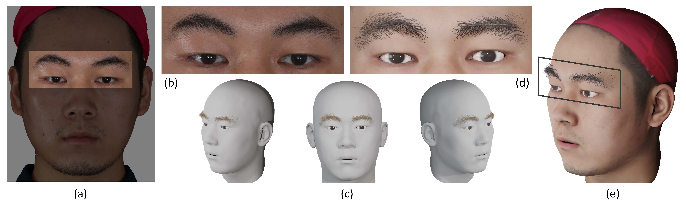
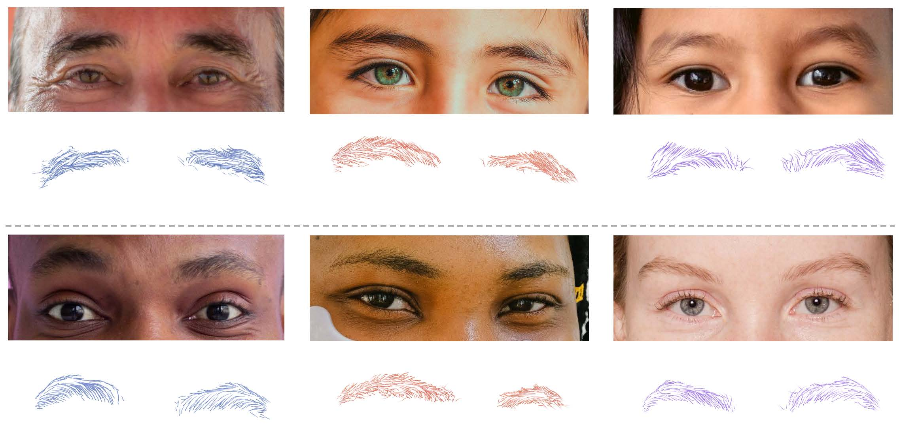

<div align="center">

<h1>EMS: 3D Eyebrow Modeling from Single-View Images</h1>

<div>
    <a href=https://kevinlee09.github.io>Chenghong Li<sup>1,2*</sup>&emsp;</a> 
    Leyang Jing<sup>2*</sup>&emsp;
    <a href=https://paulyzheng.github.io/about>YuJian Zheng<sup>1,2</sup>&emsp;</a>
    <a href=https://i.cs.hku.hk/~yzyu>Yizhou Yu<sup>3&dagger;</sup>&emsp;</a>
    <a href=https://gaplab.cuhk.edu.cn/pages/people>Xiaoguang Han<sup>2,1&dagger;</sup></a>
</div>
<div>
    FNii, CUHKSZ&emsp;
    SSE, CUHKSZ&emsp;
    The University of Hong Kong&emsp;<br>
    <sup>*</sup>equal contribution&emsp;
    <sup>&dagger;</sup>corresponding author 
</div>

<div style="margin-top: 5px;">
   <strong>ACM Transactions on Graphics (SIGGRAPH Asia 2023)
</strong>
</div>


<div style="margin-top: 10px;">
  <div style="display: inline-block;">
    <a target="_blank" href="https://arxiv.org/abs/2309.12787">
      
    </a>
      <a href="https://kevinlee09.github.io/research/EMS/" target='_blank'>
    
  </a>
  </div>

</div>

<br>


<div style="width: 80%; text-align: center; margin:auto;">
    <br>
</div>


<div align="left">

## 🔨 Installation
```
conda create -n ems python=3.8
conda activate ems

# Install pytorch
pip install torch==1.11.0+cu113 torchvision==0.12.0+cu113 torchaudio==0.11.0 --extra-index-url https://download.pytorch.org/whl/cu113

# Install pytorch3d
pip install fvcore iopath 
pip install --no-index --no-cache-dir pytorch3d -f https://dl.fbaipublicfiles.com/pytorch3d/packaging/wheels/py38_cu113_pyt1110/download.html

# Install other dependencies
pip install -r requirements.txt
```

Compile the `orient2d` cpp code which is test on `Ubuntu 20.04`, `gcc-9.4.0`. Prior to building orient2d, ensure that you have installed the `fftw3` library.
```
sudo apt-get install libfftw3-dev
```
Then use CMake to build the project:
```
cd preprocess/orient2d
mkdir build && cd build
cmake ..
make -j8
``` 

Install mesh processing libraries from [MPI-IS/mesh](https://www.baidu.com) .

## 📦 Preprocess
First, we need to prepare the input data, including the 3D head, eyebrow matting, and the orientation map.
```
bash scripts/preprocess.sh
```

## 🚀 Run EMS
Initially, you need to run the **`RootFinder`** algorithm to identify the root points, which serve as the starting locations for eyebrow growth.
```
bash scripts/test_root.sh
```
Next, execute **`OriPredictor`** to predict the direction of eyebrow growth.  In this step, each hair fiber is extended `13` samples with a unit length of `0.014`.
```
bash scripts/test_orien.sh
```
Finally, run **`FiberEnder`**  to determine the length of each eyebrow fiber.
```
bash scripts/test_len.sh
``` 
To get the blender particle system hair, you can run
```
blender -b -P npy2blend.py -- --data_item revision_013
```
📝 Note: We test our code on [blender-3.4.0](https://www.blender.org/download/releases/3-4/) and [blender-3.6.14](https://www.blender.org). However, it cannot run on versions above [blender-4.0](https://www.blender.org/download/releases/4-0/)


If you obtain the blend file, you can render the eyebrow to achieve a result similar to the figure shown:

<div style="width: 80%; text-align: center; margin:auto;">
    <br>
</div>

## 🗞️ License
The code is released under the Attribution-NonCommercial 4.0 International License.

Copyright (c) 2024

For commercial use and commercial license please contact: hanxiaoguang@cuhk.edu.cn. 


## ✋  Acknowledgement
Our code is based on these wonderful repos, many thanks to all the authors for sharing!
* [HairNet](https://github.com/papagina/HairNet_orient2D)
* [HairStep](https://github.com/GAP-LAB-CUHK-SZ/HairStep)
* [DAM-Net](https://github.com/Dancingmader/DAM-Net)
* [3DDFA_V2](https://github.com/cleardusk/3DDFA_V2)
* [Facescape](https://github.com/zhuhao-nju/facescape)
* [Detailed3DFace](https://github.com/yanght321/Detailed3DFace)
* [face-parsing.PyTorch](https://github.com/zllrunning/face-parsing.PyTorch)


## 📝 Citation
```bibtex
@article{li2023ems,
  title={EMS: 3D Eyebrow Modeling from Single-view Images},
  author={Li, Chenghong and Jin, Leyang and Zheng, Yujian and Yu, Yizhou and Han, Xiaoguang},
  journal={ACM Transactions on Graphics (TOG)},
  volume={42},
  number={6},
  pages={1--19},
  year={2023},
  publisher={ACM New York, NY, USA}
}
```